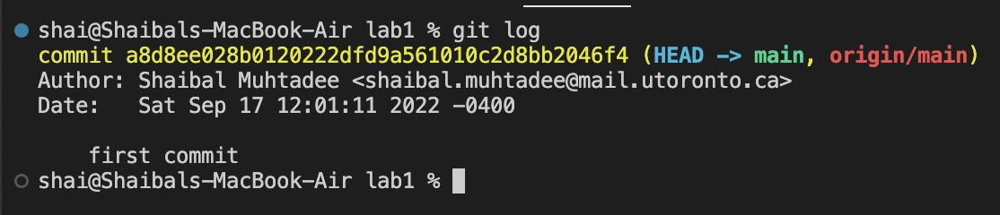

Shaibal Muhtadee

Activity 1

Activity 2

Activity 3

Activity 4
Link to partner's repo: https://github.com/FahimRT/ECE444-F2022-Lab1

Activity 5

Activity 6
Link to EP repo: https://github.com/shaibalmuhtadee/ECE444-F2022-EP

Activity 7

Activity 8

